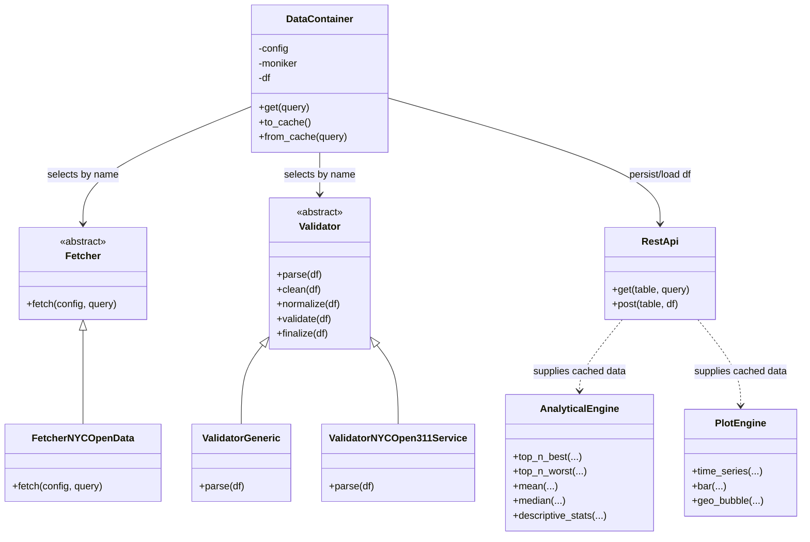
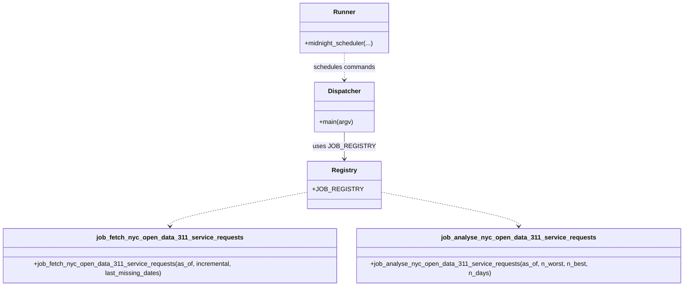

# HBC_TSY_ENHANCED

Hybrid data pipeline that pulls NYC 311 datasets from Socrata, validates/normalizes them in Python, and persists them through a small ASP\.NET EF Core REST API backed by SQLite.

# Package Map

- `hbc_configs`: Source configs (YAML) defining schemas, types, and source tokens for each moniker.
- `hbc_db`: SQLite database location (`hbc.db` lives here by default).
- `hbc_py`: Python package with DataContainer/fetchers/validators, jobs, and tests.
- `hbc_rest`: ASP\.NET Core 8 minimal API + EF Core 8 exposing CRUD/batch endpoints over the same schemas.
- `hbc_web`: Placeholder for a web/UI surface (no active code yet).

- `scripts`: Shared helpers (`env.sh` for env vars) and REST build/run scripts under `hbc_rest/scripts`.

---

# Installation

1. Clone and enter the repo:
   ```bash
   git clone https://github.com/a4shubert/hbc_tsy_enhanced.git
   cd hbc_tsy_enhanced
   ```
2. One-shot setup (loads env vars, creates venv, installs `hbc_py`, starts the published REST API):
   ```bash
   ./install.sh
   ```
   - Python only: `pip install -e hbc_py`
   - Start API only (published build): `hbc_rest/scripts/run_prod.sh`

---

# Usage Examples

- Fetch 311 service requests from Socrata:

```python
from hbc import DataContainer
dc = DataContainer("nyc_open_data_311_service_requests")
dc.get(query="$filter=created_date ge '2010-01-01' and agency eq 'NYPD'&$top=100")
dc.to_cache()  # persists via REST into SQLite
```

- Read back cached rows:

```python
dc.from_cache(query="$filter=hbc_unique_key eq 'test_123'&$top=1")
print(dc.df.head())
```

## Testing

- Lint: `ruff check hbc_py/hbc`
- Unit tests: `pytest hbc_py/hbc/tests/unit`
- Integration (live Socrata + REST): `HBC_INTEGRATION=1 pytest hbc_py/hbc/tests/integration` (requires running REST API and valid tokens in `.env`).

---

# Components

## hbc_configs (yaml)

- YAML files defining schemas and metadata for each moniker (NYC Open Data datasets).
- Tokens/IDs are read from here by both Python fetchers and the REST API models.

## hbc_db (sqlite)

- Default SQLite database location. `reset_db.sh` recreates it with the latest migrations.

## hbc_py (Python)

- **DataContainer**: entry point for each moniker (`dc = DataContainer("nyc_open_data_311_service_requests")`).
  - Fetch upstream via Socrata-like query strings: `dc.get(query="$filter=agency eq 'NYPD'&$top=250")`
  - Cache to REST API/SQLite: `dc.to_cache()`
  - Read from cache: `dc.from_cache(query="$filter=hbc_unique_key eq '...'&$top=1")`
  - Schema enforcement: missing columns are added as `None`; `hbc_unique_key` is auto-generated and retained end-to-end.
- **Fetchers/validators**: `FetcherNYCOpenData` translates OData-ish query params to Socrata; validators normalize/clean per moniker.
- **Jobs**: under `hbc_py/hbc/jobs` with dispatch tooling for CLI runs.
- **Tests**:
  - Unit benchmarks in `hbc_py/hbc/tests/unit/benchmarks`
  - Integration tests hit live Socrata/REST; enable with `HBC_INTEGRATION=1` and provide tokens in `hbc_py/hbc/tests/integration/.env`.

## UML (High-Level)

### Library



### Jobs



## hbc_rest (ASP\.Net EF Core)

- Minimal API (net8.0) with EF Core + SQLite.
- Endpoints per moniker:
  - `GET /{table}?` supports `$filter`, `$select`, `$orderby`, `$top`, `$skip`, `$count`, `$expand`
  - `POST /{table}/batch` for inserts/upserts (expects `hbc_unique_key`)
  - `DELETE /{table}/{hbc_unique_key}` for cleanup
- Logging middleware traces every request; DELETE is available for test data cleanup.
- Environment vars: `HBC_DB_PATH` (SQLite file), `HBC_API_URL` & `ASPNETCORE_URLS` (listener), `ASPNETCORE_ENVIRONMENT` (Dev/Production).

## hbc_web (Next.js)

- Reserved for future UI; currently empty.
