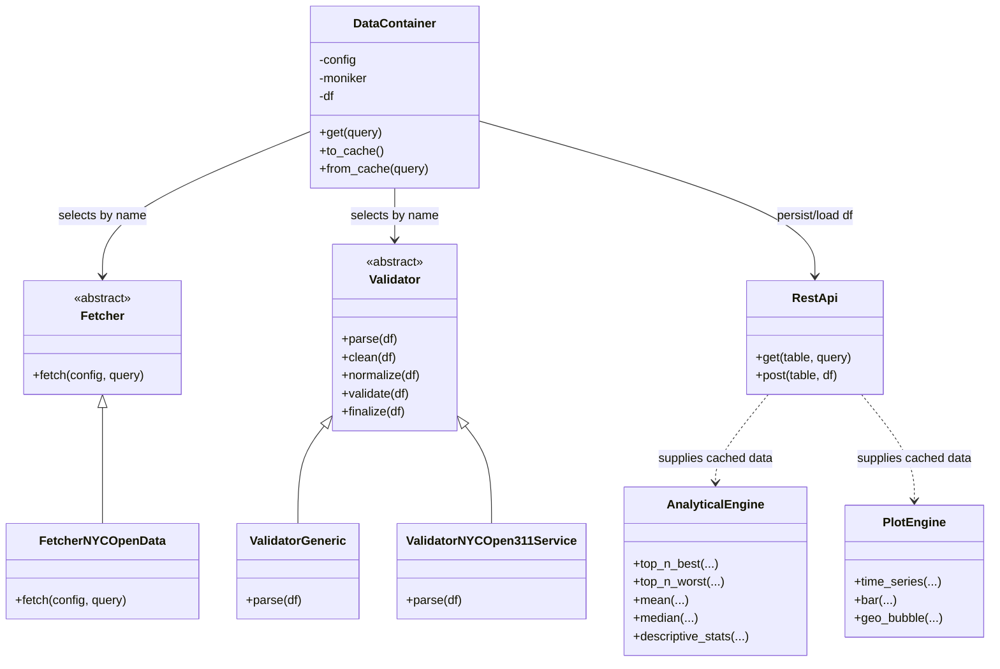

# HBC_TSY_ENHANCED

Hybrid data pipeline that pulls NYC 311 datasets from Socrata, validates/normalizes them in Python, and persists them through a minimal ASP\.NET EF Core REST API backed by SQLite.

# Table of Contents

- [Package Map](#package-map)
- [Installation](#installation)
- [Usage Examples](#usage-examples)
  - [Library](#library)
  - [Jobs](#jobs)
- [Components](#components)
  - [hbc_configs (yaml)](#hbc_configs-yaml)
  - [hbc_db (sqlite)](#hbc_db-sqlite)
  - [hbc_py (Python)](#hbc_py-python)
    - [UML (High-Level)](#uml-high-level)
  - [hbc_rest (ASPNet EF Core)](#hbc_rest-aspnet-ef-core)
  - [hbc_web (Next.js)](#hbc_web-nextjs)

# Package Map

- `hbc_configs`: Source configs (YAML) defining schemas, types, and source tokens for each moniker.
- `hbc_db`: SQLite database location (`hbc.db` lives here by default).
- `hbc_py`: Python package with DataContainer/fetchers/validators, jobs, and tests.
- `hbc_rest`: ASP\.NET Core 8 minimal API + EF Core 8 exposing CRUD/batch endpoints over the same schemas.
- `hbc_web`: Placeholder for a web/UI surface (no active code yet).

- `scripts`: Shared helpers (`env.sh` for env vars) and REST build/run scripts under `hbc_rest/scripts`.

# Installation

**Prerequisites**: Python 3.10+, .NET 8 SDK, and optionally Miniconda/conda if you prefer conda-based environments.

1.  Clone and enter the repo:
    ```bash
    git clone https://github.com/a4shubert/hbc_tsy_enhanced.git
    cd hbc_tsy_enhanced
    ```
2. One-shot setup:
   ```bash
   # macOS/Linux
   ./install.sh
   # Windows (PowerShell)
   .\install.ps1
   ```
3. Run everything (REST API + demo notebook) in background:
   ```bash
   # macOS/Linux
   ./run_all.sh
   # Windows (PowerShell)
   .\run_all.ps1
   ```

## Scripts
- `install.sh` / `install.ps1`: set up env, venv, install `hbc_py` (no servers started).
- `run_all.sh` / `run_all.ps1`: start REST API (published build) + demo notebook in background; logs in `logs/`.
- `hbc_rest/scripts/run_prod.sh` / `run_prod.ps1`: run published REST API.
- `hbc_rest/scripts/run_dev.sh` / `run_dev.ps1`: run REST API in Development profile.
- `hbc_rest/scripts/run_build.sh` / `run_build.ps1`: clean/restore/migrate/publish REST API.
- `hbc_rest/scripts/reset_db.sh` / `reset_db.ps1`: drop DB, recreate migrations, update database.
- `hbc_py/scripts/run_demo_notebook.sh` / `run_demo_notebook.ps1`: launch classic Jupyter for `hbc_py/notebooks/Demo.ipynb`.
- `hbc_db/scripts/count_rows.sh`: print row counts for all SQLite tables (uses `HBC_DB_PATH` or `hbc_db/hbc.db`).

# Usage Examples

## Library

_Data Container_:

```python
dc = DataContainer("nyc_open_data_311_customer_satisfaction_survey")

# retrieve: query first 100 rows
dc.get()
dc.df.shape

# retrieve: query distinct
dc.get(query="$apply=groupby((campaign))")
dc.df.shape

# retrieve: query with filter
dc.get(query="$filter=campaign eq 'Campaign 4'")
dc.df.shape

# caching:
dc.to_cache()

# from_cache: get 10 rows
dc.from_cache()
dc.df.shape

# from_cache: get by filter
dc.from_cache(query="$filter=campaign eq 'Campaign 4'")
dc.df.shape

# from_cache: get distinct
dc.from_cache(query="$apply=groupby((year))")
dc.df.shape

# from_cache: get page 2 with page size 50
dc.from_cache(query="$top=50&$skip=50")
dc.df.shape

# from_cache: get total count
dc.from_cache(query="$count=true")
dc.df.shape
```

_Analytics_:

```python
app_context.as_of  = ul.str_as_date('20091231')

dc = DataContainer('nyc_open_data_311_service_requests')

# query / load / validate:
dc.get(query=f"$filter=created_date eq '{ul.date_as_iso_format(app_context.as_of)}'")

# persist:
dc.to_cache()

# retrieve from cache for analytics:
dc.from_cache(query=f"$filter=created_date eq '{ul.date_as_iso_format(app_context.as_of)}'")

# enrich:
df = dc.df
cols = ul.cols_as_named_tuple(df)
df["hbc_days_to_close"] = (pd.to_datetime(df[cols.closed_date])- pd.to_datetime(df[cols.created_date])).dt.days.astype("Int64")
cols = ul.cols_as_named_tuple(df)
m = df[cols.hbc_days_to_close] == 0
df_closed_not_same_day = df[~m]

# plot:
path = ul.path_to_str(
                ul.mk_dir(app_context.dir_analytics / "plots")
                / "closed_requests_by_location.html"
            )
_ = PlotEngine.plot_geo_map(
            df=df_closed_not_same_day,
            col_latitude=cols.latitude,
            col_longitude=cols.longitude,
            aggregation="count",
            round_precision=3,
            cluster=True,
            start_zoom=11,
            tiles="CartoDB positron",
            savepath= path
        )

# analyze:
## by agency:
res = AnalyticalEngine.descriptive_stats(
    n_best=10,
    n_worst=10,
    df=df_closed_not_same_day,
    col_metric=cols.hbc_days_to_close,
    group=[
        cols.agency,
        cols.agency_name,
    ],
)
```

## Jobs:

Use the job dispatcher to execute the built-in pipelines.

_Poll one day of data into cache_:

```bash
python -m hbc.jobs.dispatch \
  --job-name=job_fetch_nyc_open_data_311_service_requests \
  --as-of=20091231 \
  --incremental=True \
  --log-level=DEBUG
```

_Run analytics for that date_:

```bash
python -m hbc.jobs.dispatch  \
  --job-name=job_analyse_nyc_open_data_311_service_requests \
  --as-of=20091231 \
  --log-level=INFO \
  --n-worst=10 \
  --n-best=10 \
  --n-days=10
```

_Restore cache integrity for the last few missing dates (fetches multiple days)_:

```bash
python -m hbc.jobs.dispatch  \
  --job-name=job_fetch_nyc_open_data_311_service_requests \
  --as-of=20091231 \
  --incremental=false \
  --log-level=INFO \
  --last-missing-dates=10
```

_Midnight Scheduler_:

```bash
python -m hbc.jobs.runner
```

# Components

## hbc_configs (yaml)

- YAML files defining schemas and metadata for each moniker (NYC Open Data datasets).
- Tokens/IDs are read from here by both Python fetchers and the REST API models.

## hbc_db (sqlite)

- Default SQLite database location. `reset_db.sh` recreates it with the latest migrations.

## hbc_py (Python)

### api:

- **Context** (`hbc/api/context`): carries logical date and dirs; CLI dispatch can override dirs/date, and utility helpers honor an overridden base dir for consistent artifact locations.
- **DataContainer** (`hbc/api/container`): entry point for each moniker (`dc = DataContainer("nyc_open_data_311_service_requests")`).
  - Fetch upstream via Socrata-like query strings: `dc.get(query="$filter=agency eq 'NYPD'&$top=250")`
  - Cache to REST API/SQLite: `dc.to_cache()`
  - Read from cache: `dc.from_cache(query="$top=10")`
  - Schema enforcement: missing columns are added as `None`; `hbc_unique_key` is auto-generated and retained end-to-end.

### ltp:

- **Fetchers** (`hbc/ltp/loading/fetchers`): fetch only `FetcherNYCOpenData` wraps Socrata with retries/backoff, pagination, etc. Fetcher factory resolves by name from config.
- **Validators** (`hbc/ltp/loading/validators`): clean/normalize/validate/finalize via `Validator.parse`. Default is `ValidatorGeneric` (no-op); `ValidatorNYCOpen311Service` implements NYC-specific rules and logging.

### jobs:

- **Jobs**: (`hbc_py/hbc/jobs`) with dispatch tooling for CLI runs.

### quant:

- **Analytics/Plots** (`hbc/quant/analysis.py`, `hbc/quant/plots.py`): `AnalyticalEngine` provides ranking/summary helpers (best/worst/mean/median); `PlotEngine` offers plotting utilities for time series, bars, and geo bubbles.

### tests:

- Lint: `ruff check hbc_py/hbc`
- Unit tests: (`pytest hbc_py/hbc/tests/unit`)
- Integration (live Socrata + REST): `HBC_INTEGRATION=1 pytest hbc_py/hbc/tests/integration` (requires running REST API and valid tokens in `.env`).

#### UML (High-Level)

##### Library



##### Jobs


## hbc_rest (ASP\.Net EF Core)

- Minimal API (net8.0) with EF Core + SQLite.
- Endpoints per moniker:
  - `GET /{table}?` supports `$filter`, `$select`, `$orderby`, `$top`, `$skip`, `$count`, `$expand`
  - `POST /{table}/batch` for inserts/upserts (expects `hbc_unique_key`)
  - `DELETE /{table}/{hbc_unique_key}` for cleanup
- Logging middleware traces every request; DELETE is available for test data cleanup.
- Environment vars: `HBC_DB_PATH` (SQLite file), `HBC_API_URL` & `ASPNETCORE_URLS` (listener), `ASPNETCORE_ENVIRONMENT` (Dev/Production).

## hbc_web (Next.js)

- Reserved for future UI; currently empty.
