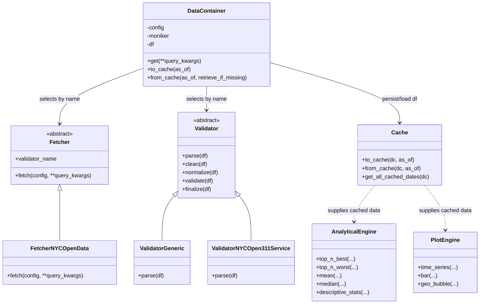

# NYC 311 Open Data (Pipleine and Analytics)

Library + jobs to fetch, cache, and analyze NYC 311 service request data.

_Updates_:

- DataContainer `df` setter now validates columns against the config schema on assignment.
- `app_context` is simplified; set the logical date directly (e.g., `app_context.as_of = datetime.date(...)`).
- Fetchers always receive a non-`None` `as_of` from DataContainer.
- Cache snapshots are stored as gzipped CSVs; `from_cache` transparently ungzips and re-zips.
- Job dispatch adds `--dir-base`, `--dir-cache`, `--dir-analytics`, and `--dir-logging` to override runtime dirs; utility paths stay aligned when `--dir-base` is provided.
- FetcherNYCOpenData accepts Socrata query kwargs directly; pass `date=`/`created_date=` (`YYYY-MM-DD` or `yyyymmdd`) to auto-build a `where` on `created_date` and use `limit=100` as the default when no query is supplied.
- Fetch/validate responsibilities are split: fetchers only fetch; validators (default generic, override via config) handle clean/normalize/validate/finalize with logging.

## Install

```bash
pip install git+https://github.com/a4shubert/hbc_tsy_enhanced.git
```

## Running as Jobs

Use the job dispatcher to execute the built-in pipelines. Artifacts (cache/logs/analytics) are written under `app_context.dir_base` (see `utils.get_dir_base` for the current location; override as needed). The installed package name is `hbc` (repo: `hbc_tsy`).

_Poll one day of data into cache_:

```bash
python -m hbc.jobs.dispatch --job-name=job_poll_nyc_311 --as-of=2009-12-31 --incremental=True --log-level=INFO
```

_Run analytics for that date_:

```bash
python -m hbc.jobs.dispatch --job-name=job_analysis_nyc_311 --as-of=2009-12-31 --n-worst=10 --n-best=10 --n-days=10 --log-level=INFO
```

_Restore cache integrity for the last few missing dates (fetches multiple days)_:

```bash

python -m hbc.jobs.dispatch --job-name=job_poll_nyc_311 --as-of=2009-12-31 --incremental=False --last-missing-dates=5 --log-level=INFO
```

### Midnight Scheduler (optional)

_Run jobs (every midnight)_:

```bash
python -m hbc.jobs.runner
```

## Using as a Library

_Fetch data programmatically, save to cache, and read it back_:

```python
from hbc import DataContainer, app_context, utils as ul

# set logical as-of date (defaults to today)
app_context.as_of = "2009-12-31"

# Fetch once and cache
dc = DataContainer("nyc_open_data_311_service_requests")
dc.get(
    where=f"created_date = '{ul.date_as_iso_format(app_context.as_of)}'"
)
dc.to_cache(app_context.as_of)

# Later: load from cache
df = dc.from_cache(app_context.as_of, retrieve_if_missing=False)
print(df.head())


# Load a different data set
dc = DataContainer('nyc_open_data_311_call_center_inquiry')
# exploratory  100 (default) rows
dc.get()
# with the query
dc.get(where=f"agency='NYPD'", limit=200)
```

## Demo Notebook

A walk-through lives in `notebooks/Demo.html` (rendered) and the accompanying notebook. Open it in your browser or notebook viewer to see end-to-end examples of fetching, cleaning, and plotting the data.

## Design

- **Context/paths** (`hbc/api/context.py`, `utils.py`): `app_context` carries logical date and dirs; CLI dispatch can override dirs/date, and utility helpers honor an overridden base dir for consistent artifact locations.
- **DataContainer** (`hbc/api/container.py`): loads config/moniker/schema, orchestrates fetcher + validator, enforces schema awareness on assignment, applies a safety `limit=100` when no query kwargs are given, and handles cache I/O.
- **Fetchers** (`hbc/ltp/loading/fetchers`): fetch only. `FetcherNYCOpenData` wraps Socrata with retries/backoff, pagination, and date→where convenience. Fetcher factory resolves by name from config.
- **Validators** (`hbc/ltp/loading/validators`): clean/normalize/validate/finalize via `Validator.parse`. Default is `ValidatorGeneric` (no-op); `ValidatorNYCOpen311Service` implements NYC-specific rules and logging. Selected by name in config, logged when used.
- **Caching** (`hbc/ltp/persistence/cache.py`): reads/writes gzipped CSV snapshots under `app_context` dirs, keeping cache compressed after reads.
- **Configuration** (`hbc/ltp/configs/*.yaml`): define moniker, fetcher, credentials/URL, schema, and optional validator. Query kwargs are supplied at call time rather than embedded in config.
- **Analytics/Plots** (`hbc/quant/analysis.py`, `hbc/quant/plots.py`): `AnalyticalEngine` provides ranking/summary helpers (best/worst/mean/median); `PlotEngine` offers plotting utilities for time series, bars, and geo bubbles.

## UML (High-Level)

### Data Pipeline


